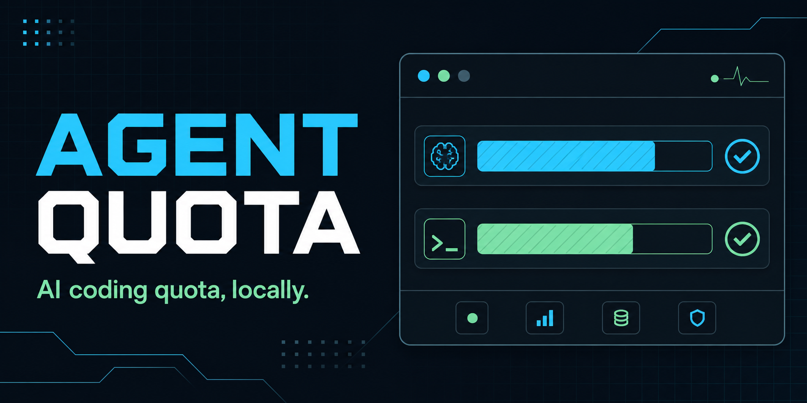

# Agent Quota



**Local-first Codex and Claude Code quota monitoring for terminals and developer tools.**

[](https://github.com/Halven08/agent-quota/actions/workflows/ci.yml)
[](https://github.com/Halven08/agent-quota/actions/workflows/security.yml)
[](https://github.com/Halven08/agent-quota/releases/latest)
[](LICENSE)

Agent Quota is a Rust library and CLI that answers two separate questions:

1. Could quota information be collected reliably?
2. Does the reported quota have room for another agent run?

Keeping those answers separate makes Agent Quota suitable for terminal use and
for embedding in desktop applications, status bars, CI helpers, and internal
developer dashboards.

- One normalized, versioned snapshot for multiple providers.
- Human-readable terminal output plus JSON and NDJSON for automation.
- Multi-account profiles with independent caching and failure handling.
- No telemetry, credential storage, or source-code collection.

> [!IMPORTANT]
> Agent Quota is an independent project, not an official OpenAI, Anthropic,
> Codex, or Claude Code product. Provider interfaces can change.

## Quick start

Install the latest tagged version with Cargo, verify local prerequisites, and
check all available providers:

```bash
cargo install --git https://github.com/Halven08/agent-quota --tag v0.3.0 agent-quota
agent-quota doctor
agent-quota status
```

Use `agent-quota status --json` for a stable machine-readable snapshot. An
exhausted quota is reported as valid data; provider or authentication failures
are reported separately.

## Provider support

| Provider | Local source | Provider contact | Typical impact |
| --- | --- | --- | --- |
| Codex | Signed-in Codex CLI | Local `codex app-server` process | Reads account and rate limits; does not submit a prompt |
| Claude Code | Local OAuth credential file | Anthropic Messages API | Sends a fixed `hi` message with `max_tokens: 1`; may affect quota or billing |

Credentials are read into memory and are never stored by Agent Quota. Source
code, repository contents, terminal history, and user prompts are not sent.

## Install

### Prebuilt binary

Download the archive for your operating system, extract `agent-quota` (or
`agent-quota.exe`), and place it somewhere on your `PATH`.

| Platform | v0.3.0 download |
| --- | --- |
| Windows x86-64 | [ZIP](https://github.com/Halven08/agent-quota/releases/download/v0.3.0/agent-quota-windows-x86_64.zip) |
| Linux x86-64 | [tar.gz](https://github.com/Halven08/agent-quota/releases/download/v0.3.0/agent-quota-linux-x86_64.tar.gz) |
| macOS Apple silicon | [tar.gz](https://github.com/Halven08/agent-quota/releases/download/v0.3.0/agent-quota-macos-aarch64.tar.gz) |
| macOS Intel | [tar.gz](https://github.com/Halven08/agent-quota/releases/download/v0.3.0/agent-quota-macos-x86_64.tar.gz) |

Checksums are published in
[`SHA256SUMS`](https://github.com/Halven08/agent-quota/releases/download/v0.3.0/SHA256SUMS).

### Build with Cargo

Rust 1.88 or newer is required:

```bash
cargo install --git https://github.com/Halven08/agent-quota --tag v0.3.0 agent-quota
```

From a local checkout:

```bash
cargo install --path crates/agent-quota-cli
```

Provider prerequisites:

- Install and sign in to the Codex CLI for Codex checks.
- Sign in with Claude Code once so its local credential file exists. Agent Quota
  reads that file but does not invoke the Claude Code executable.

Verify setup without making quota requests:

```bash
agent-quota doctor
```

## CLI

```bash
agent-quota status
agent-quota status --json
agent-quota status --provider codex
agent-quota status --config agent-quota.toml --profile claude-work
agent-quota watch --interval 300
agent-quota watch --json
agent-quota doctor --config agent-quota.toml
agent-quota profiles list --config agent-quota.toml
```

Example terminal output:

```text
Provider/profile      Plan/account             Quota
--------------------  -----------------------  ----------------------------------------
Codex                 Plus / you@example.com   5h window: 58% left, resets in 2h 8m
Claude Work           Max                     EXHAUSTED — Weekly window: 0% left
```

Reset times include a relative duration and an RFC 3339 timestamp in the local
time zone. Watch intervals must be at least 60 seconds. Results are cached for
five minutes, and completely failed checks are not cached.

`watch --json` emits one compact JSON array per line (NDJSON). A one-shot status
command emits pretty JSON.

### Exit codes

| Code | Meaning |
| --- | --- |
| `0` | Command completed; at least one requested probe succeeded, or no probe was required |
| `1` | Configuration, diagnostics, or serialization failed |
| `2` | Command-line usage error |
| `3` | Every requested provider probe failed |

An exhausted quota is a successful probe and therefore does not itself produce
a failing process exit code. Read `quotaState` when automating routing.

## Snapshot contract

Serialized snapshots include `schemaVersion: 1`. The two decision fields are:

- `probeStatus`: `ok`, `authentication_required`, `unsupported`,
  `transient_error`, `invalid_response`, or `invalid_configuration`.
- `quotaState`: `available`, `exhausted`, or `unknown`.

Only `probeStatus == "ok"` together with `quotaState == "available"` is a safe
positive routing signal.

`observedAtMs` uses Unix epoch milliseconds.
`resetsAtEpochSeconds` uses Unix epoch seconds.

See the [schema notes](docs/snapshot-schema-v1.md) and the
[canonical JSON fixture](crates/agent-quota-core/fixtures/provider-usage-v1.json).
Downstream consumers should test against that fixture and reject unknown schema
versions.

## Multiple accounts

Profiles label local accounts and provide paths or environment overrides. They
must not contain OAuth tokens or API keys.

```toml
[[profiles]]
id = "claude-work"
provider = "claude"
label = "Claude Work"
credentials_path = "C:/Users/you/.claude-work/.credentials.json"

[[profiles]]
id = "codex-private"
provider = "codex"
label = "Codex Private"

[profiles.env]
CODEX_HOME = "C:/Users/you/.codex-private"
```

See [`agent-quota.example.toml`](agent-quota.example.toml) for a complete
starter file.

Profile IDs must be unique and non-empty. Unknown configuration fields are
rejected so spelling mistakes fail visibly. Supported provider-specific fields:

| Field | Codex | Claude |
| --- | --- | --- |
| `command_path` | Optional executable path | Not supported |
| `credentials_path` | Not supported | Optional credential file |
| `env` | Optional process overrides | Not supported |
| `enabled` | Supported | Supported |

Codex multi-account behavior depends on whether the installed Codex CLI honors
the supplied environment or configuration override.

## Library

The library is currently distributed from tagged GitHub releases. Pin the exact
`0.x` tag:

```toml
[dependencies]
agent-quota-core = { git = "https://github.com/Halven08/agent-quota", tag = "v0.3.0" }
```

```rust,no_run
use agent_quota_core::{
    AgentQuotaClient, CollectUsageOptions, ProbeStatus, QuotaState,
};

# async fn example() {
let snapshots = AgentQuotaClient::new()
    .collect_usage(CollectUsageOptions::all())
    .await;

for snapshot in snapshots {
    let can_run = snapshot.probe_status == ProbeStatus::Ok
        && snapshot.quota_state == QuotaState::Available;
    println!("{}: {can_run}", snapshot.profile_name);
}
# }
```

For UI polling, use `ProviderUsageCache::collect`; each complete profile is
keyed independently, so a failed profile can recover while successful profiles
remain cached. Custom HTTP clients, provider timeouts, Claude model, and Claude
endpoint overrides are available for embedding and deterministic tests.

## Troubleshooting

Start with:

```bash
agent-quota doctor
```

- **Executable not found:** install the relevant CLI or set
  `command_path` for a Codex profile.
- **Authentication required:** sign in again with the provider CLI. Failed
  checks are not cached, so the next status command retries immediately.
- **Unsupported:** update the provider CLI. The installed provider may no
  longer expose the response shape Agent Quota understands.
- **Invalid response:** include the Agent Quota version, provider CLI version,
  operating system, and redacted JSON error in a bug report. Never attach
  credential files.
- **Claude provider impact:** use the default five-minute cache and avoid
  repeatedly forcing fresh collections in embedded applications.

## Project status

Agent Quota is an early `0.x` public release. The serialized schema is explicitly
versioned, but the Rust API may evolve between minor releases until `1.0`. Pin
releases, review [`CHANGELOG.md`](CHANGELOG.md), and keep an adapter between
Agent Quota and application-specific routing policy.

Contributions are welcome. See [`CONTRIBUTING.md`](CONTRIBUTING.md) and report
security concerns according to [`SECURITY.md`](SECURITY.md). Participation is
governed by the [`CODE_OF_CONDUCT.md`](CODE_OF_CONDUCT.md).

Licensed under the [MIT License](LICENSE).
